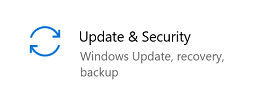
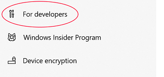
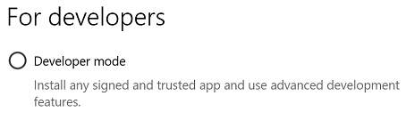
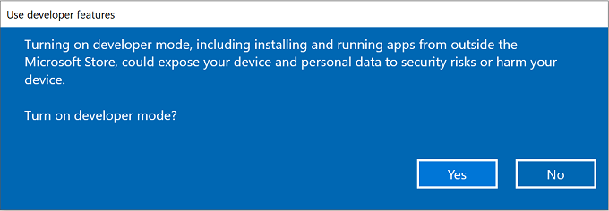
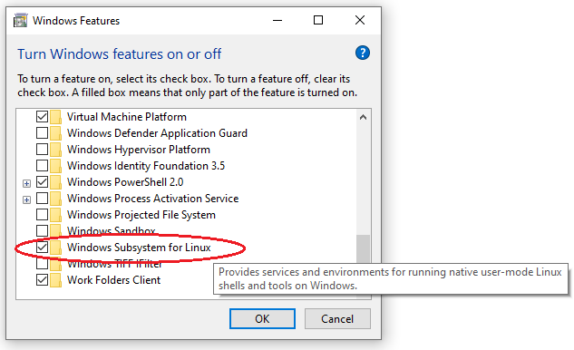
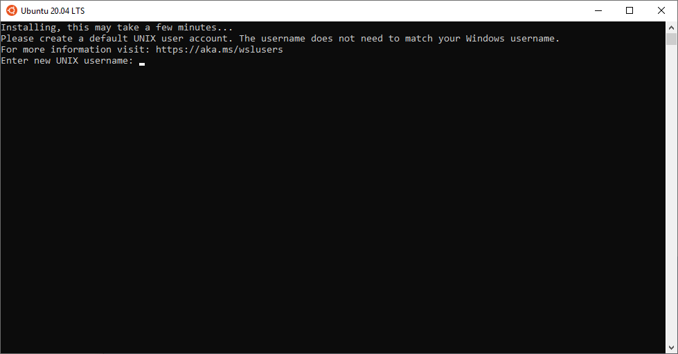
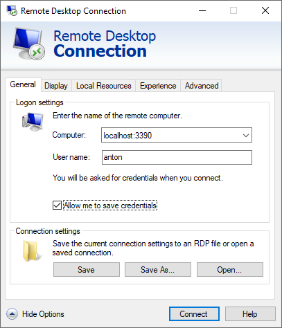
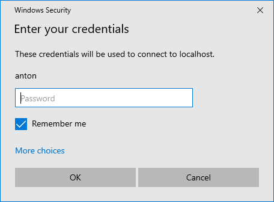
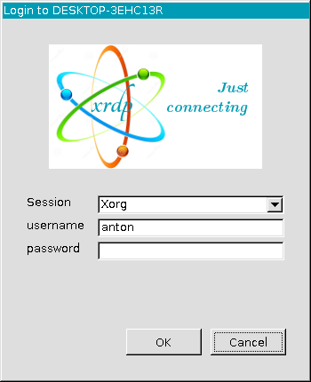

# Use Ubuntu with Desktop on Windows
With the right setup it is possible to use Ubuntu WSL (= Windows Subsystem for Linux) on Windows not just using the terminal, but also a desktop environment. All this with only a single click (or double click ;)).

Used versions:
* Ubuntu WSL operating system (hereinafter referred to as Ubuntu): Ubuntu 20.04 LTS
* Windows operating system (hereinafter referred to as Windows): Windows 10 Pro, Version 1909


## Plan of attack
* Install Ubuntu on Windows
* Install desktop environment on Ubuntu
* Create a mechanism that performs following actions with a singe click:
    * Start Ubuntu
      * Start remote desktop server
    * Start remote desktop client

Sounds good? So let's get started...


## Install Ubuntu on Windows
Steps to perform:


### Activate the Developer Mode (if not yet done)
1. If not yet done, activate the Developer Mode:
  * Open the Start menu.  
  * Type _Settings_ and click on the appearing entry.  
      
  * Click on _Update & Security_.  
      
  * On the left, choose _For Developers_.  
      
  * If the _Developer Mode_ option is activated, there's nothing to do here. Otherwise click on it.  
      
  * You'll be asked if you are sure to turn the developer mode on and install it's components. Click on _Yes_, which will trigger the installation. Wait until the installation has completed.  
      

2. Install Windows Subsystem for Linux
  * Open the Start menu.
  * Type _Windows Features_ and click on the appearing entry.  
      
  * Scroll down to the entry _Windows Subsystem for Linux_ and click the checkbox if not yet activated.  
    
  * Click on _OK_.  Grant administrator rights if asked for.

3. Reboot Windows.

   
4. Install Ubuntu:
  * Open the Start menu.  
  * Type _Store_ and click on the appearing entry.  
      
  * Click the _Search_ field in the top right corner, type in _Ubuntu_, and hit enter.  
  * Choose the newest Ubuntu version and click on it.  
        
  * Click on _Get_ and wait until the download has finished.
  * When the download has completed, click on _Launch_.  
  * (For starting Ubuntu at a later time, you can open the start menu, type _Ubuntu_ and clock on the appearing entry, which might not yet available yet.)  
    
  * Now the   Ubuntu terminal windows should have opened.  
      
  * Enter your desired Ubuntu username (which does not need to be the same as your Windows username).  
  * Enter the desired password for your new Ubuntu user. Repeat the password entry.  
  * Now you should see a linux prompt waiting for your commands.  
    Congratulations, you've just installed Ubuntu on your Windows machine!

5. Install system components
  * System, XFCE, xrdp
    ``` bash
    # Update the system.
    sudo apt update && sudo apt -y upgrade
    
    # Install the (lightweight) XFCE desktop environment.
    sudo apt -y install xfce4
    
    # Install remote desktop (RDP) server.
    sudo apt-get install xrdp
    
    # Configure the RDP server.
    sudo cp /etc/xrdp/xrdp.ini /etc/xrdp/xrdp.ini.bak
    sudo sed -i 's/3389/3390/g' /etc/xrdp/xrdp.ini
    sudo sed -i 's/max_bpp=32/#max_bpp=32\nmax_bpp=128/g' /etc/xrdp/xrdp.ini
    sudo sed -i 's/xserverbpp=24/#xserverbpp=24\nxserverbpp=128/g' /etc/xrdp/xrdp.ini
    
    # Start the xrdp server (manually).
    sudo /etc/init.d/xrdp start
    ```
  * Adapt xrdp configuration file
    ``` bash
    sudo sed -i 's%\(test -x /etc/X11/Xsession && exec /etc/X11/Xsession\)%#\1%g' /etc/xrdp/startwm.sh
    sudo sed -i 's%\(exec /bin/sh /etc/X11/Xsession\)%#\1%g' /etc/xrdp/startwm.sh
    echo -e "\n# xfce\nstartxfce4" | sudo tee -a /etc/xrdp/startwm.sh > /dev/null
    ```

6. Start Windows remote desktop:
  * Open the Start menu.  
  * Type _Remote_ and click on the appearing entry.  
      
  * Click on _Show Options_ in the bottom left corner to expand the window.  
  * Enter the connection information as follows:  
    
    * Computer: localhost:3390
    * User name: \<USER\>
    * Allow me to save credentials: Check if it's okay for you to store the password. This allows for logging in directly.
  * Click on _Connect_.
      * If the _Allow me to save credentials_ option is active, a Windows prompt will appear to ask for the Ubuntu user's password. Windows will store this password for future logins.  
        
      * If the _Allow me to save credentials_ option is not active, the xrdp prompt will appear and ask for your Ubuntu user's password. This window will appear on each login.   
        
  * Now you should see the full screen XFCE desktop environment.
        

## Starting Ubuntu with desktop environment
This seems to be the most tricky part of this whole setup.
Fortunately it is possible to execute commands on Ubuntu using the Windows command line:
``` bat
wsl.exe <command>
```
Or for short:
``` bat
wsl <command>
```

### Challenges
Keeping in mind that our goal is to use just use a single click (or execution of a single command) to start Ubuntu with a desktop environment, we face following challenges:
* After booting Windows, Ubuntu is down and needs to get started in order to use it. It gets started with its first execution (running `wsl.exe` on the Windows command or execute the program directly from the filesystem). However, when executing Ubuntu, it opens a terminal window, which we don't want.
* Since at the moment the Ubuntu WSL does not have the classical startup-process (using `/etc/init.d`) implemented, we need to start the remote desktop server manually.
* If we want to launch an Ubuntu terminal on Windows, we should be able to do so!

### Close the opened Ubuntu WSL terminal
_So how to start Ubuntu without leaving a command line opened?_

At this point it's important to understand the mechanism.

Since running `wsl.exe` is the only way to boot the system and this command opens a terminal window, we need to close this window automatically.
Therefore, we need an `exit` command in the `~/.bashrc`, which has the downside that if we open an Ubuntu terminal later on, it will close immediately.

To solve this, the most straight forward solution seems to be using a flag. This flag can be implemented using a file within Ubuntu, as it can be accessed by Windows and Ubuntu. The existence if this file means that the flag is set, otherwise it's not set.

When running our start script on Windows (see below), this flag needs to be set using `wsl.exe touch /tmp/wsl_flag` and after starting Ubuntu, the flag needs to be reset using `rm /tmp/wsl_flag`.


### Start the remote desktop server (xrdp)
_So how to get the remote desktop server (xrdp) started when there's no startup system on the Ubuntu WSL?_

To solve this problem we just hook the solution of the first problem and start the server on the first login (i.e. after booting Ubuntu) using `sudo /etc/init.d/xrdp start`.

Did you recognize the `sudo`? This is necessary if you want to start a service as a regular user. But to use it, there need's to be an appropriate entry in the sudoers config.
We'll make use of the `/etc/sudoers.d/` system, which means that we create a new file called `xrdp` in this folder, which gets analysed automatically by the sudoers system.
This approach is more flexible, since there's no more need to modify the `/etc/sudoers` file.

To create this sudoers entry, run
``` bash
sudo vi /etc/sudoers.d/xrdp
```
Then paste the following config text in it and replace `<USER>` with your Ubuntu username.:

```
# Allow xrdp server to work with sudo

<USER>   ALL=(ALL) NOPASSWD: /etc/init.d/xrdp
```
Save the file and then change the file mode as follows:
``` bash
sudo chmod 440 /etc/sudoers.d/xrdp
```

<span style="color:red; font-size:1.2em;">Attention:</span>
* If you (for any reason) want to use another file name, be aware of not using `.` or `~` in it. Otherwise it will not be scanned from the sudoers system.
* If you made a mistake in copying the content to the file, sudoers can't be executed anymore, because it claims there's a file with an invalid syntax. 
  That way you locked yourself out executing root commands. To fix this, just open the Windows command line and enter the following command, which will remove the malformed config file:
``` bat
wsl -u root rm /etc/sudoers.d/xrdp
```
or if you need somewhat more control, use:
``` bat
wsl -u root bash
```
and execute all necessary commands.


### Bringint it all together
To perform all these action at once, we need some scripts. Note, that some commands below may run asynchronously.

#### Starting script on Windows
Create a new file which might be called `Start Ubuntu 20.04 LTS WSL VM.bat` and paste this code in it:
``` bat
@echo "Starting Ubuntu 20.04 LTS WSL VM..."
@echo off
wsl touch /tmp/wsl_flag
wsl
start /B mstsc /f /v:localhost:3390
```
Executing this script perform these actions:
* Set (create) the flag.
* Start Ubuntu.
* Start the Windows remote desktop client which will connect to the server.

#### Starting script on Ubuntu
Add the following code block to the very end of `~/.bashrc`:
``` bash
# Exit from login if just used to start WSL
flag="/tmp/wsl_flag"

if [ -f "${flag}" ] ; then
  rm "${flag}"

  # Start xrdp server
  sudo /etc/init.d/xrdp start

  # Wait for service is running
  while ! service --status-all 2>&1 | grep xrdp | grep + >/dev/null ; do
    sleep 1
  done

  echo "Cancelling from login"
  exit
fi
```
When the user logs in, this code checks if the flag is set.
* If it is not set (which is the case on all logins performed after the very first one), it just does nothing and behaves like normal.
* If the flag is set though it performs these actions:
  * Unset (remove) the flag.
  * Start the remote desktop server and wait until it's running.
  * Cancel the login process (which automatically closes the terminal window).


## Test
On clicking the script `Start Ubuntu 20.04 LTS WSL VM.bat` on Windows, you should see the Ubuntu terminal opening, printing some output on it and closing automatically. Then the remote desktop client starts and connects to the server. You should now see the XFCE desktop from Ubuntu in full screen.

_**Congratulations!**_


## Conclusion
After installing the necessary software, the whole mechanism comes down to:
* Interaction between Windows and Ubuntu.
* Handle everything on the first run (= booting) of Ubuntu.
* Grant access privileges.
* Automate everything using scripts.


## Notes
* Unfortunately I didn't succeed to get audio running on my Ubuntu WSL.
